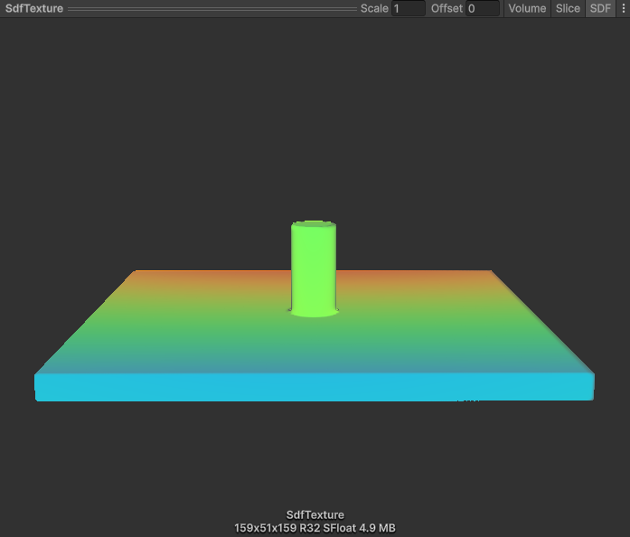
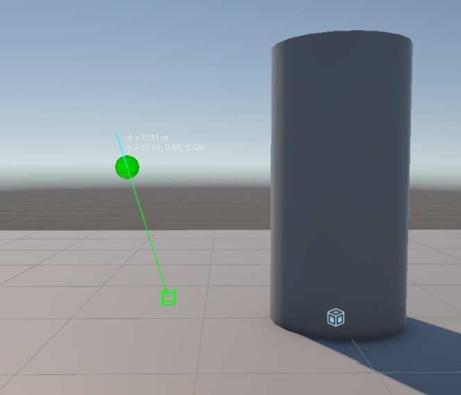
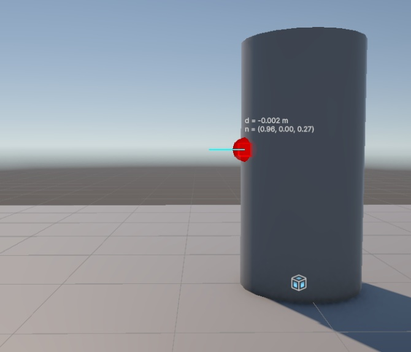
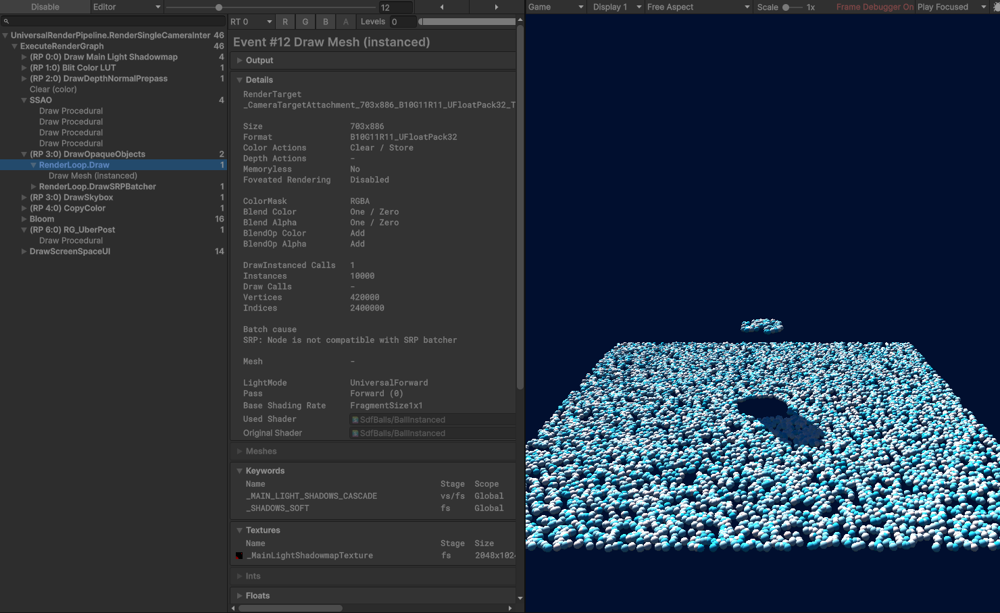
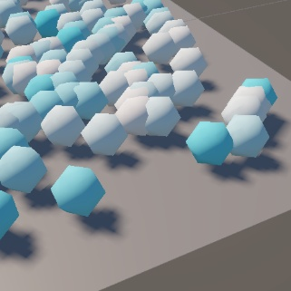
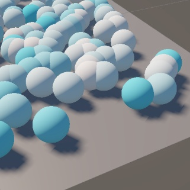
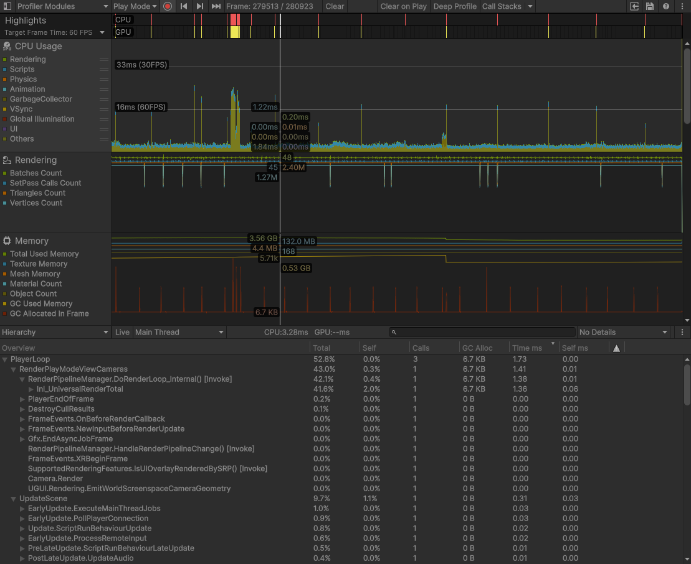

# 10,000 balls against a signed distance field

## Introduction

Ten thousand spheres fall onto a plane and a cylinder, bounce, settle, spill over the edge and come back.
There are no colliders and no rigidbodies: the static geometry is baked offline into a signed distance
field, the simulation is one Burst job over two arrays, and every ball is drawn in one instanced call.

**Measured:** 10,000 balls at **2.7 ms per frame (≈ 370 fps)** in a release build, of which the simulation
is **0.15 ms**. The 60 fps ceiling is around **200,000 balls** with 80-triangle spheres.

Hardware and the full tables are in the [Numbers](#numbers) section.

Unity 6000.3.21f1 (Unity 6.3 LTS), Universal Render Pipeline 17.3.0.

| Brief requirement | Where it lives |
|---|---|
| Baked SDF | `Assets/ScriptableObjects/Baked/SceneSdf.asset` |
| Collide 10,000 balls against SDF | `Runtime/Physics/Jobs/BallPhysicsJob.cs` |
| Jobs and Burst | `Runtime/Physics/Mono/BallPhysicsSimulationBehaviour.cs` |
| One instanced draw | `Runtime/Rendering/Mono/BallRendererBehaviour.cs` + `Assets/Rendering/BallInstanced.shader` |
| Numbers on screen | `Runtime/UI/Mono/StatsOverlayBehaviour.cs` |

## How to run

1. Open the project in Unity 6000.3.21f1 and open `Assets/Scenes/MainScene.unity`.
2. Press **Play**. The baked field is pre-created, so nothing needs to be baked first.
3. The panel in the corner shows ball count, frame time (mean and worst over 0.25 s), simulation time,
   substeps, the field's resolution, and the triangle budget for balls and for shadows. Buttons **÷ 2** and
   **× 2** change the ball count at runtime, **Reset** drops every ball again.

## How to bake

Select the `SdfBakeArea` object in the scene. Its inspector has three buttons:

- **Fit To Shapes** shrink-wraps the volume around every `SdfShapeBehaviour` plus a margin.
- **Bake** evaluates the field in a Burst job and writes `Assets/ScriptableObjects/Baked/SceneSdf.asset`
  (a ScriptableObject holding the grid, with the Texture3D as a sub-asset so re-baking never breaks
  references).
- **Verify Field** compares the baked, interpolated field against the analytic truth at 110,000 random
  points and logs the error.

Baking never happens on load or per frame. The field does not track the scene: after moving a shape or
changing the bake settings a rebake is needed. The inspector warns when bounds or cell size differ from the
baked asset.

**Current bake:** 159 × 51 × 159 @ 0.07 m, 1,289,331 samples, 4.9 MB of floats (10 MB on disk because text
serialization writes pixels as hex). The bake job takes 3 ms, writing the asset takes 0.4 s.

## Packages and project settings

**Burst** 1.8.30, **Mathematics** 1.3.3

No **Collections**, since `NativeArray` and `IJobParallelFor` are engine core.

Removed from the URP template as unused: Input System, Timeline, Visual Scripting, AI Navigation,
Multiplayer Center, Version Control, and the template's tutorial assets.

Changed: Active Input Handling → Input Manager.

PC URP asset → 2 shadow cascades, 30 m shadow distance. Haven't changed the mobile ones.

## Assumptions

- The ground is a 10 × 10 slab 0.5 m thick under the Plane mesh. Balls that roll off and fall are respawned
  in the spawn box once they drop 1 m below the plane.
- Ball radius 0.06 m, spawn box 9 × 4 × 9 m starting 6 m up. Both are inspector fields.
- Shapes are declared with an `SdfShapeBehaviour` (Cylinder or Plane), not detected from mesh names.
- Balls do not rotate, so they slide to a stop rather than roll.

## Approach

### SDF

- The scene is defined as Unity primitives, so the baker evaluates exact distance functions (box, cylinder)
  and takes their minimum. The sign is right by construction. The Plane mesh has no thickness and therefore
  no inside, it is baked as a slab 0.5 m deep whose top face is the mesh, so balls can rest on it and fall
  off its edge.
- The volume covers the surfaces plus a 0.5 m margin, not the space balls fly through. The margin must
  exceed ball radius + one cell, because the sampler reads the eight vertices around the ball's center,
  0.5 m also keeps the rim and the cylinder cap, where balls spill, inside exact data. Cell size 0.07 m
  against a 0.06 m ball radius.
- Since a job cannot touch a `Texture3D`, at startup `GetPixelData<float>` gives a NativeArray view of its
  pixels, which is validated (format, readability, sample count against the grid) and copied once into a
  persistent array the simulation owns. One 5 MB memcpy at startup and nothing per frame.
- Sampling and gradient are done using trilinear interpolation of the eight surrounding vertices, and the
  exact derivative of that same interpolant from the same eight values. Distance and gradient come back
  together from one call, because the job is bound by memory traffic.
- **What happens outside of the SDF?** For the balls outside of the field the returned distance is
  `sqrt(d_clamped² + |p − clamped|²)`. I am finding the nearest point on the box's wall and look up the
  distance in it, then the diagonal between these two values is calculated, this guarantees that the
  distance will not be overestimated. In our scenario it can be just the distance taken from the nearest
  point, but if the field is baked right on top of the surface with no margin this approach will break the
  simulation. The gradient is calculated the same as for balls inside SDF. The further we are from the solid
  surface, the bigger it is.

Verify Field at 0.07 m cells, in the band 0–20 cm outside a surface where every contact decision is made:
mean error 0.27 mm, max 19.7 mm (the concave corner where the cylinder meets the floor), zero sign
mismatches, mean gradient error 0.55°.

*Figure 1. SDF texture preview*

### The simulation

- Memory layout is two `NativeArray<float3>`: positions and velocities. SoA is chosen because the renderer
  uploads the positions array unchanged and nothing is extracted or converted per frame.
- Balls never interact, so each ball's whole frame is independent work. `BallPhysicsJob` loads a ball once,
  runs all the frame's fixed substeps on it, and stores it once. Fixed step 1/120 s from an accumulator,
  capped at 4 per frame: an overloaded frame becomes slow motion, and never more work.
- Operations per substep: respawn if below the kill height → gravity → move by sphere tracing → resolve
  contact.
- The field value minus the radius is how far a ball can travel in any direction and touch nothing, so the
  displacement is consumed in pieces of that length. In contact the inward component of the motion is
  removed and the rest slides. With this scene's thickness plain projection would survive to about 60 m/s,
  but tracing makes correctness independent of speed and thickness and is what a distance field uniquely
  provides.
- Touching means clearance ≤ 1 mm, not only overlap. Overlap is removed by position projection along the
  gradient. There is a restitution 0.3 above an approach speed of 0.5 m/s, and zero below it. Friction is
  Coulomb in impulse form, so a sliding ball decelerates at **μ·g** regardless of the step size.

To check simulation correctness there is a **LogStats** context menu on `BallPhysicsSimulation`. It scans
the arrays against the field itself. When checking 5 s after landing and 10,000 balls I am getting:
*0 sunk, min clearance 0.00 mm, 10,000 in contact with a max speed of 0.00 cm/s* and this is the desired
result. To test the SDF there is a `DebugProbeBehaviour` object in the scene. This is a gizmo rendered ball
to check where is inside and outside of the figures in the field.

|  |  |
|---|---|
| *Figure 2. Ball outside of obstacle* | *Figure 3. Ball inside of obstacle* |

### The rendering

- `Graphics.RenderMeshPrimitives` is called only once per frame, see *Figure 4*.
- Data being transferred per frame is the positions array as-is computed in the physics simulation,
  **12 bytes per ball, 120 KB at 10k**, into one structured buffer. The shader reads the center by
  `SV_InstanceID`, radius is one float, per-ball colour is a hash of the instance id, so variety costs zero
  bytes.
- Mesh is generated in `IcosphereMeshBuilder` at startup. I've created 4 subdivisions with different numbers
  of vertices and triangles, more on it in the **Icosphere Subdivisions** part. The chosen default
  subdivision is 1: **42 vertices, 80 triangles.** The reason to go with a generated mesh is not to use
  Unity's sphere (which is 760 triangles) or any other assets. It simplifies prototyping and testing a lot.
- Shadows are rendered both ways, because ground shadows are what make the shower read as objects above a
  surface. Their cost is very articulated: the balls are drawn once more per shadow cascade, so this was the
  first place to save frame budget. The project ships with 2 cascades and a 30 m shadow distance (the scene
  fits inside it and the template's 4 cascades over 50 m cost twice as much for blurrier shadows).

*Figure 4. Frame debugger demonstrating one draw instanced call for 10000 balls*

### Icosphere Subdivisions

The instanced mesh is built in code in `IcosphereMeshBuilder`, so its triangle count is a parameter: the
*Subdivisions* field on the `BallRenderer`. Different subdivisions have different levels of detail. Level 0
is a plain icosahedron, Level 1 is a sharp sphere, whereas Level 2 and 3 are well rounded and barely
distinguishable from each other. For this project I've chosen level 1 to be the default, as more triangles
on the spheres are not making any difference with this distant camera and angle. I've also performed all
the measurements for level 0 as well, as it was giving different results on higher numbers of balls, hence
different processes have become the bottleneck (see the [Numbers](#numbers) section). The visual difference
between them is presented in *Figures 5–8*. Vertices and triangles count can be seen in the table below.
Triangles per frame are also including the triangles needed for shadows to render.

| Subdivision | Vertices | Triangles per ball | Triangles per frame at 10k |
|---|---|---|---|
| 0 | 12 | 20 | 0.6 M |
| 1 | 42 | 80 | 2.4 M |
| 2 | 162 | 320 | 9.6 M |
| 3 | 642 | 1280 | 38.4 M |

|  |  |  |  |
|---|---|---|---|
| *Figure 5. Subdivision 0* | *Figure 6. Subdivision 1* | *Figure 7. Subdivision 2* | *Figure 8. Subdivision 3* |

## Numbers

Tested on: Release build (Mono), 1920×1080 windowed, 2 shadow cascades, 30 m shadow distance, default
physics settings.

**CPU:** 11th Gen Intel(R) Core(TM) i7-11800H @ 2.30GHz (2.30 GHz)

**GPU:** NVIDIA GeForce RTX 3060 Laptop GPU (6 GB)

**Shower** = 2 s after reset, everything in motion. **Settled** = 10 s after.

Icosphere level 1 (80 triangles per ball, the default):

| Balls | Shower: frame, ms | Shower: worst, ms | Shower: sim, ms | Settled: frame, ms | Settled: worst, ms | Settled: sim, ms |
|---|---|---|---|---|---|---|
| 10 000 | 2.70 | 5.59 | 0.15 | 2.74 | 4.57 | 0.12 |
| 40 000 | 4.29 | 6.41 | 0.27 | 3.80 | 4.86 | 0.30 |
| 160 000 | 12.72 | 13.22 | 1.32 | 12.75 | 13.39 | 1.68 |
| 640 000 | 48.76 | 49.54 | 15.26 | 48.72 | 49.02 | 16.14 |

Icosphere level 0 (20 triangles per ball):

| Balls | Shower: frame, ms | Shower: worst, ms | Shower: sim, ms | Settled: frame, ms | Settled: worst, ms | Settled: sim, ms |
|---|---|---|---|---|---|---|
| 10 000 | 2.62 | 3.90 | 0.11 | 2.37 | 3.32 | 0.12 |
| 40 000 | 2.74 | 4.69 | 0.30 | 2.58 | 4.57 | 0.39 |
| 160 000 | 3.64 | 6.05 | 0.93 | 4.10 | 7.41 | 1.23 |
| 640 000 | 15.31 | 28.65 | 7.68 | 15.97 | 22.08 | 9.91 |

*Figure 9. Profiler at 10k balls, Icosphere level 1*

### Where it falls over, and why

- At 10k nothing is the bottleneck: both meshes give ~2.6 ms, so the frame is fixed overhead (engine,
  shadow setup, the overlay), not triangles and not simulation. The simulation is ~5% of the frame with this
  number of balls.
- Moving the number of balls up, the GPU gives out first. With 80-triangle balls the frame scales with
  triangle count: ×4 balls from 160k to 640k is ×3.8 frame time. 640k balls × 80 triangles × 3 passes is
  154 million triangles per frame. The 60 fps line is crossed at roughly **200,000 balls**.
- When using level 0 subdivision that line is moved to roughly **700,000 balls.** By then, rendering is
  becoming less of a bottleneck than the simulation itself, and it is memory bound.
- Settled is not cheaper than shower by design. There is no sleeping, so the table shows the true cost of
  simulating N balls in either state.

Editor numbers are 30–50% worse (safety checks, editor overhead) and are not quoted.

## Afterword and final thoughts

### Known limitations

- Sharp edges are rounded by about one cell. Trilinear interpolation cannot represent a crease.
- A ball wedged where the cylinder meets the floor hovers by up to 2 cm: interpolating a minimum of two
  distances in a corner cell underestimates it by about a quarter cell. Scales with cell size.
- The gradient jumps by up to ~8° across cell faces on the cylinder's side. Nothing rests on a vertical
  wall, so it touches a ball only for the frames it slides down.

### Deliberately not built

- There is a possibility to gain a lot of frame time with the majority of balls resting. A resting ball can
  never be moved again in this scene, so a per-ball flag could skip most of a settled pile. Skipped on
  purpose: it would make the settled numbers stop meaning "the cost of N balls".
- Cross-frame job overlap (schedule after the upload, complete next frame): would make the frame
  ≈ max(render, sim) instead of the sum, worth ~5% at 10k and ~20% at 640k, for one frame of latency. Didn't
  do that to have pure rendering and positions consistency during simulation.
- Quad impostors: 2 triangles per ball with a ray-sphere intersection in the fragment shader. This can
  potentially speed up the simulation a lot on higher numbers of balls.
- A general mesh-to-SDF baker. For a real world scenario this would probably be needed, but not necessary
  for this case.
- Staleness tracking for the bake (input hash, inspector warning, build check). Too much work for a small
  simulation. Will be needed for a real task.

### With another day

- Impostors – to get the maximum out of rendering.
- Job overlap – to reduce the simulation bottleneck.
- Experiment with job batch size 64 → 256 and see where the simulation is going to struggle.

### AI usage disclosure

AI assistance was used for scaffolding and prototyping. Every decision in code is owned by me.
